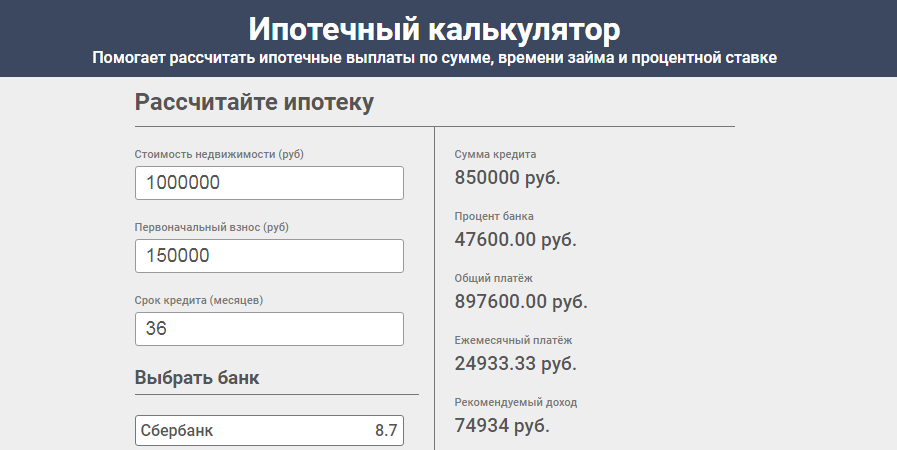

# <a name='nav'>Mortgage</a>

Приложение "Ипотечный калькулятор", написанное на HTML, CSS и чистом JavaScript. Вы можете посмотреть демо-версию приложения на [GitHub Pages по этой ссылке](https://voverg.github.io/calculators/mortgage/index.html 'Посмотреть демо-версию')

- [Описание](#description)
- [Description(eng)](#description_eng)

---

## <a name='description'>Описание</a>
Приложение "Ипотечный калькулятор":
- Введите стоимость недвижимости
- Введите первоначальный взнос
- Введите срок кредита
- Выберите процентную ставку
- Калькулятор рассчитает сумму кредита, процент банка, общий и ежемесячный платёж

[Назад к заглавию](#nav)

## <a name='description_eng'>App description</a>
This is a simple habit tracker application written by html, css and clean javascript. You can see this app demo version on [GitHub Pages this link](https://voverg.github.io/calculators/mortgage/index.html 'Look at demo')

Habits tracker app:
- Input mortgage cost
- Input an initial fee
- Input credit term
- Choose interest rate
- The calculator will calculate the loan amount, the percentage of the bank, the overall and monthly payment

[Back to menu](#nav)
